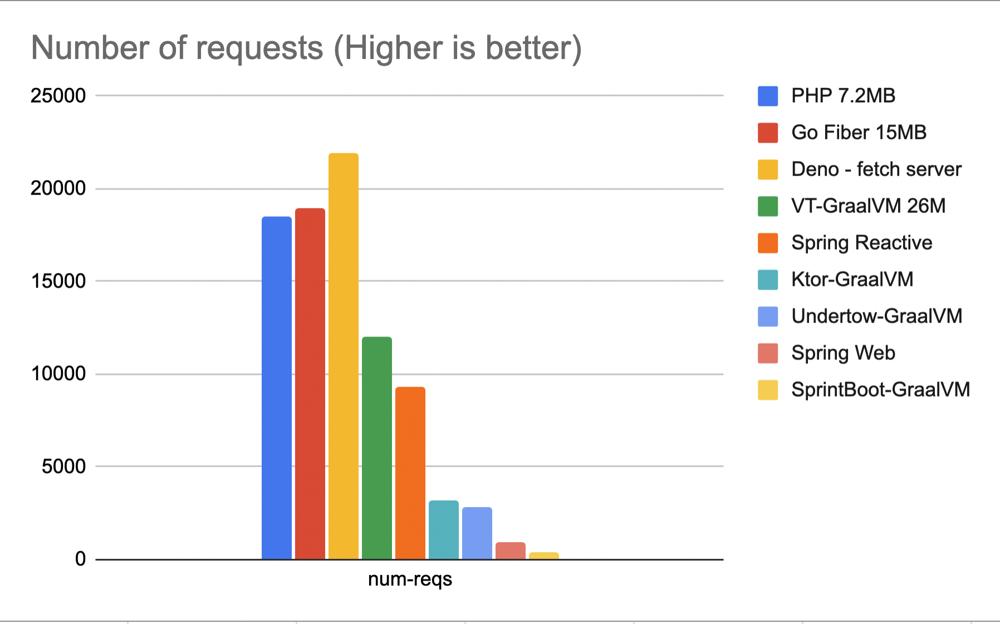
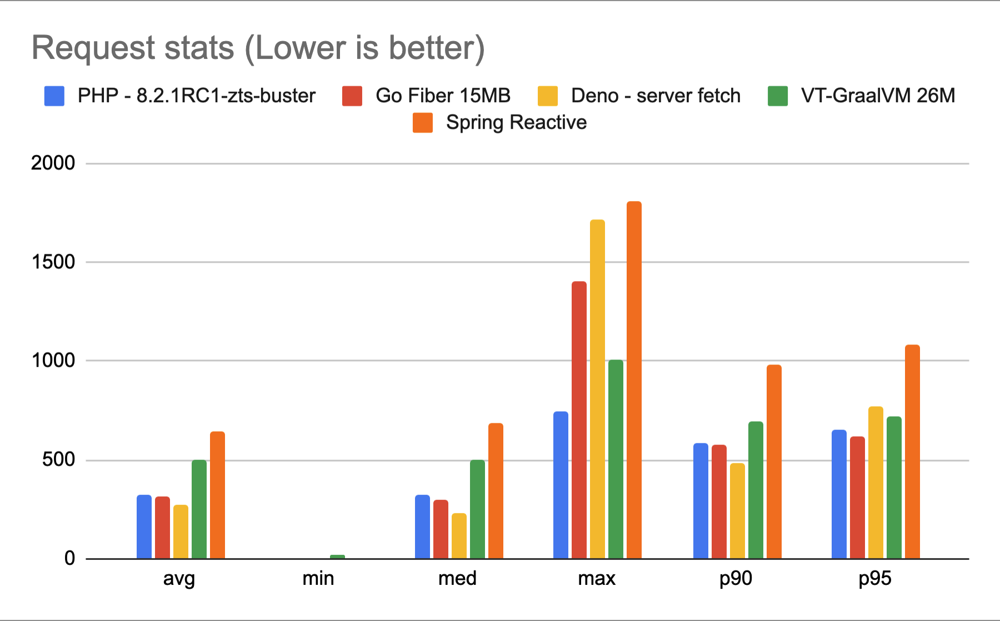

# http-rest-proxy-benchmarks

HTTP REST proxy benchmarks.

## Test Method

```
# run the container
docker run --rm -it --memory="32MB" --cpus="0.5" -p 8080:8080 --name app-name app-name:0.0.1

# run the test
k6 run --no-usage-report --vus 100 --duration 60s --summary-export out.json script.js
```


## Test scenario

Containers under test use 32 MB memory and 0.5 CPU.

100 Virtual Users for 60 seconds.

```
	Go	Deno	VT      Ktor	bun     Undertow	PHP - 8.2.1RC1-zts-buster	Spring Reactive 	Spring Web
avg	315.9	273.3	503.55	1906	exit	2145		323.6				645.9			6828
min	0.785	5.161	14.125	126.3	exit	13.13		7.573				645.9			0.819
med	299.1	227.5	505.25	1886	exit	2059		321.1				645.9			2371
max	1405	1715	1291.5	5557	exit	4611		747.6				645.9			32995
p90	574	486	705.875	2691.6	exit	2301.5		583.24				645.9			17309
p95	619 	770	796.395	2992.5	exit	2322.3		655.45				645.9			23081

num-reqs
	18980	21964	11929	3200	0       2845		18533				9324			899
```

Number Of Requests



Request Statistics



Request Statistics with Ktor


Request Statistics All of the apps


