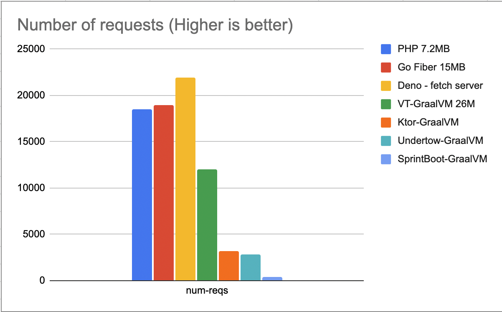
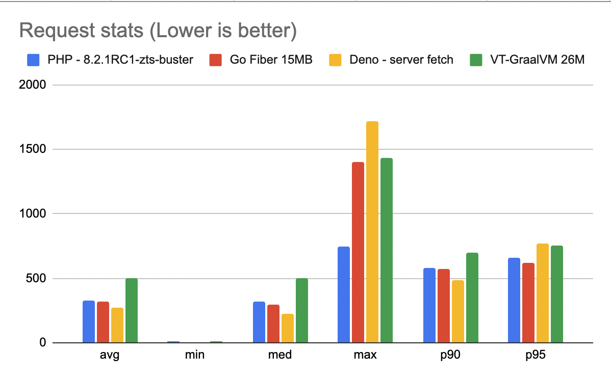
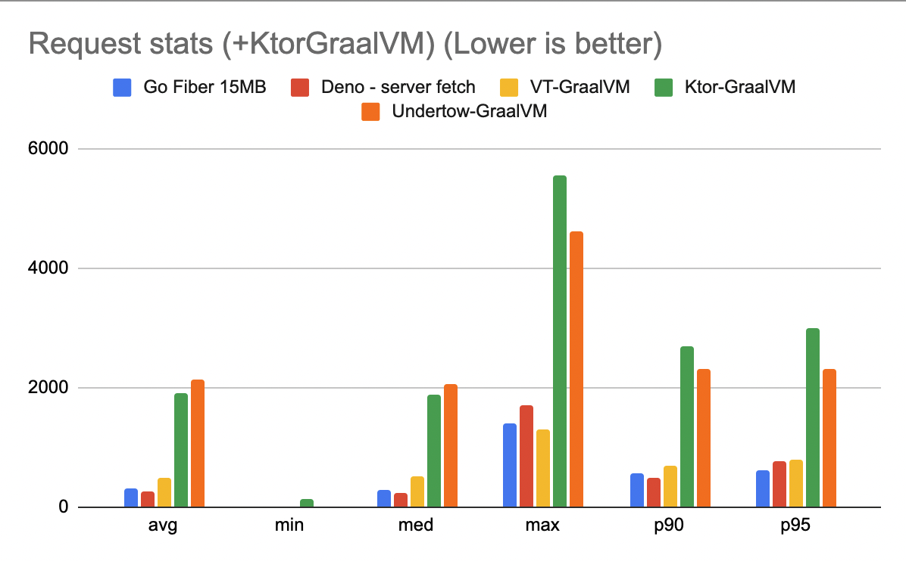
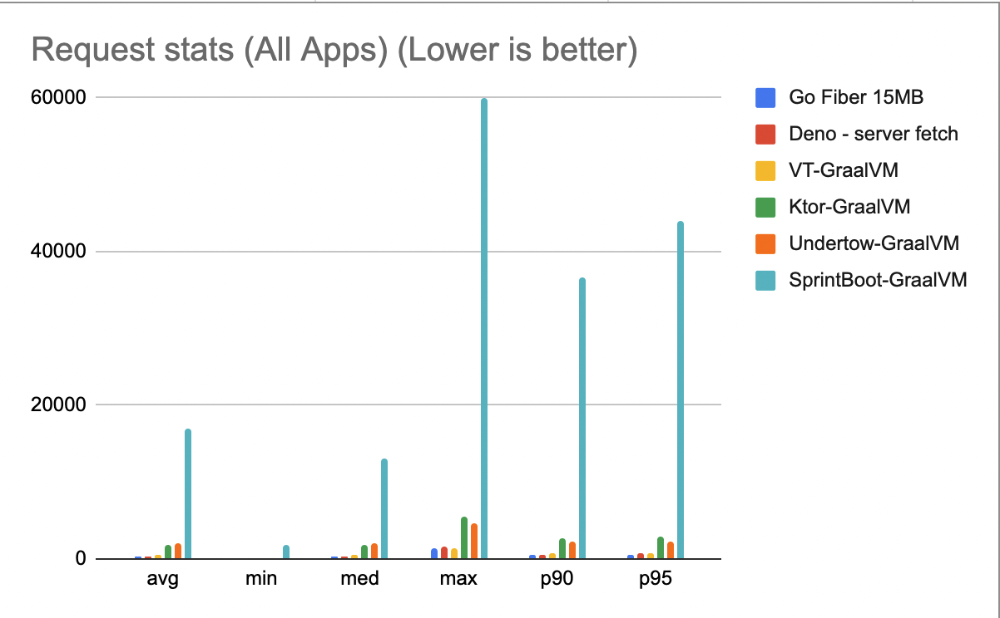

# http-rest-proxy-benchmarks

HTTP REST proxy benchmarks.

## Test Method

```
# run the container
docker run --rm -it --memory="32MB" --cpus="0.5" -p 8080:8080 --name app-name app-name:0.0.1

# run the test
k6 run --no-usage-report --vus 100 --duration 60s --summary-export out.json script.js
```


## Test scenario

Containers under test use 32 MB memory and 0.5 CPU.

100 Virtual Users for 60 seconds.

```
	Go	Deno	VT      Ktor	bun     SprintBoot  Undertow
avg	315.9	273.3	503.55	1906	exit	17047	    2145
min	0.785	5.161	14.125	126.3	exit	1823	    13.13
med	299.1	227.5	505.25	1886	exit	13030	    2059
max	1405	1715	1291.5	5557	exit	59883.1	    4611
p90	574	486	705.875	2691.6	exit	36543.1	    2301.5
p95	619 	770	796.395	2992.5	exit	43885.5	    2322.3

num-reqs
	18980	21964	11929	3200	0       368	    2845
```

Number Of Requests



Request Statistics



Request Statistics with Ktor


Request Statistics All of the apps


